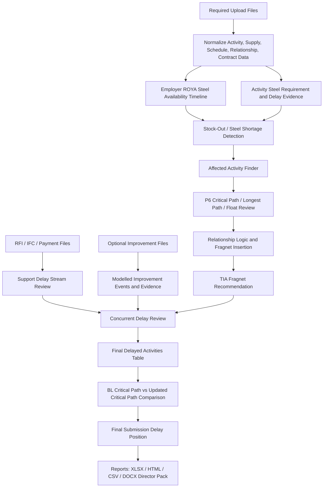

# Delay TIA Conclusion Methodology Summary

This document explains, in summary form, how the Delay TIA module concludes the delayed activities, delayed days, critical-path position, concurrency treatment, and final submission delay days from the uploaded files.

## Main Rule

The TIA calculation uses **Employer ROYA supplied steel only** for steel-delay calculations.

Contractor / SAMCO supplied steel is shown for visibility only and is **not used to reduce, calculate, or defend the steel-delay impact**.

## Uploaded Files Used

| Upload File | Main Use in TIA | Output Effect |
|---|---|---|
| `01- master_activity_steel_analysis.csv` | Activity-level steel need, activity dates, delayed duration, affected activity ID/name | Identifies delayed steel activities and number of delayed days |
| `02- employer_steel_supply.csv` | Employer delivery dates and quantities | Builds steel availability / stock-out logic |
| `03- p6_activity_export.csv` | Current schedule dates, float, critical flag, longest path | Determines updated critical path / longest path status |
| `04- relationship_file.csv` | Predecessor and successor logic | Supports fragnet insertion and causation chain |
| `05- contract_library.csv` | Contractual entitlement, notice, money/time support | Supports claim strength and entitlement explanation |
| `06- ifc_conflict.csv` | IFC/design conflict delay records | Adds IFC support delay stream and concurrency review |
| `07- payments.csv` | Payment/cashflow delay records | Adds payment support delay stream where relevant |
| `08- rfi_status.csv` | RFI status and affected activities | Adds RFI support delay stream |
| `10- samco_steel_supplied_at_site.csv` | Contractor steel supply visibility only | Display only; excluded from delay calculation |

## Optional Improvement Files

Files uploaded under **Optional Improvement Files for TIA Calculation** improve the analysis:

| Optional File | Use |
|---|---|
| `02-delay_event_register_template.csv` | Adds structured delay events with affected activities and delayed days |
| `03-activity_impact_register_template.csv` | Adds activity impact support |
| `04-fragnet_logic_register_template.csv` | Adds modelled fragnet events that can affect final TIA days |
| `05-claimed_delay_register_template.csv` | Adds claimed delayed days by activity |
| `06-causation_matrix_template.csv` | Adds cause-effect explanation |
| `07-concurrency_matrix_template.csv` | Adds event overlap / concurrency support |
| `08-evidence_register_template.csv` | Adds evidence traceability |
| `09-primavera_fragnet_import_template.csv` | Adds Primavera-ready fragnet rows |
| `18-rfi_delay_claim6_normalized.csv` | Adds detailed RFI delay days and affected activities |
| `RFI Delay.csv` | Adds detailed RFI delay logic into concurrency/final-delay review |

## How the TIA Conclusion Is Built

1. The system reads the master activity file and identifies activities affected by steel unavailability.
2. Employer steel deliveries are converted into an availability timeline.
3. The system compares required steel against Employer supplied steel.
4. If an activity has insufficient Employer steel, it becomes a potential delayed activity.
5. P6 data is used to check whether the activity is critical, longest path, near-critical, or non-driving.
6. Relationship logic is used to identify where the fragnet should be inserted.
7. The fragnet duration is calculated from delayed days, fragment dates, and recovery/availability logic.
8. IFC, RFI, payment, and optional improvement files are reviewed as support or modelled delay streams.
9. Concurrent delay review checks whether events overlap by activity or time window.
10. Final delayed activities are listed with:
    - affected activity ID,
    - affected activity name,
    - number of delayed days,
    - BL critical path status,
    - updated critical path status,
    - updated longest path status.
11. The final submitted delay days are concluded using conservative net/max logic, not simple addition.

## Final Delay Logic

The final total is not calculated by adding every delay row together.

The system separates:

- **Gross detected delayed days**: all loaded delay evidence before concurrency treatment.
- **Steel TIA-modelled days**: steel fragnet delays calculated from Employer-only supply logic.
- **Improvement-register modelled days**: optional uploaded fragnet / claimed-delay register days.
- **Support-stream days**: RFI, IFC, payment rows that support the case but are not automatically added unless modelled.
- **Recommended total delayed days to submit**: conservative final position after avoiding double counting.

## Visualization



## Final Output Tables

The reports and slides now include a **Number of Delayed Days** column where delay duration is relevant.

The key final table is:

```text
Final Delayed Activities
```

It shows:

- delay stream,
- delay reference,
- affected activity ID,
- affected activity name,
- number of delayed days,
- BL critical path status,
- updated critical path status,
- updated longest path status,
- total float,
- delay start,
- delay finish,
- treatment basis.

At the end, the table shows:

- gross delayed activity total before concurrency de-duplication,
- recommended total delayed days to submit.

## Conclusion Principle

The TIA conclusion is based on a defensible chain:

```text
Event Evidence -> Affected Activity -> Schedule Logic -> Critical Path / Longest Path -> Fragnet Duration -> Concurrency Review -> Final Delay Days
```

The final submitted delay days should be treated as the **conservative TIA position**, supported by the uploaded records and subject to final planning/contracts review.
